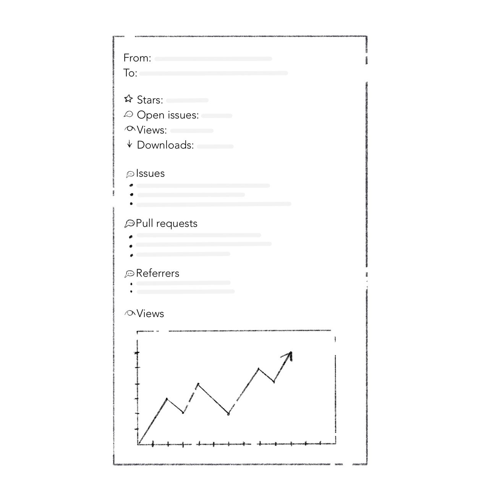

While working on MeetingBar, I noticed that I refresh the statistic pages on GitHub very often. I even wrote a telegram bot that sends me a count of installs and repository stars every morning. So I decided to make a service for analytics and reports for open-source projects.

### Let's start from a blank page

When I open my project page, I have two needs: dopamine and useful information.

Dopamine is stored in numbers. Downloads, stars, views. I want to receive this data often and to be able to compare their values with the previous ones.

Useful information lies deeper. In comments on the issues, updates to the pull requests, new project referrers. It already comes in GitHub notifications, but they are generated for each action. So it would be convenient to receive a full report for a certain time instead of viewing a dozen notifications during the day.

In addition to all this, it would be nice to have a project status visualization that can be shared. Thus, every project on GitHub can get the basis to become an open startup without additional effort.

So I need to build a platform that collects&stores data from GitHub, makes dashboards, and sends reports. It looks like a great bunch of work!

### Scoping

Let's start with simple Proof Of Concept.

The easiest way to validate an idea is to build a service that periodically collects necessary data and sends an email report. At this point, we will skip the UI part with dashboards and data storing for metrics comparison.

This data will be collected every morning and send to me by email.

The letter will have the following structure:

- First, there will be numbers to satisfy my excitement.

- Then issues and pull requests that have changed over the past day.

- And in the end, there will be traffic.

The traffic section requires a lot of effort with authorization and visualization. But I decided to include it in PoC because it will cover all my needs for opening a GitHub every morning.

### What's next?

The implementation story.

Then I'll try to use it for a week. So I'll understand whether it's useful and what needs to be improved.

> 📌 If you are interested in this idea, contact me. I'll notify you as soon as I plan the beta.

---

[Subscribe](https://leits.substack.com/welcome?r=h8qz8&utm_campaign=account&utm_medium=web&utm_source=leits.me) to receive the latest issue!
