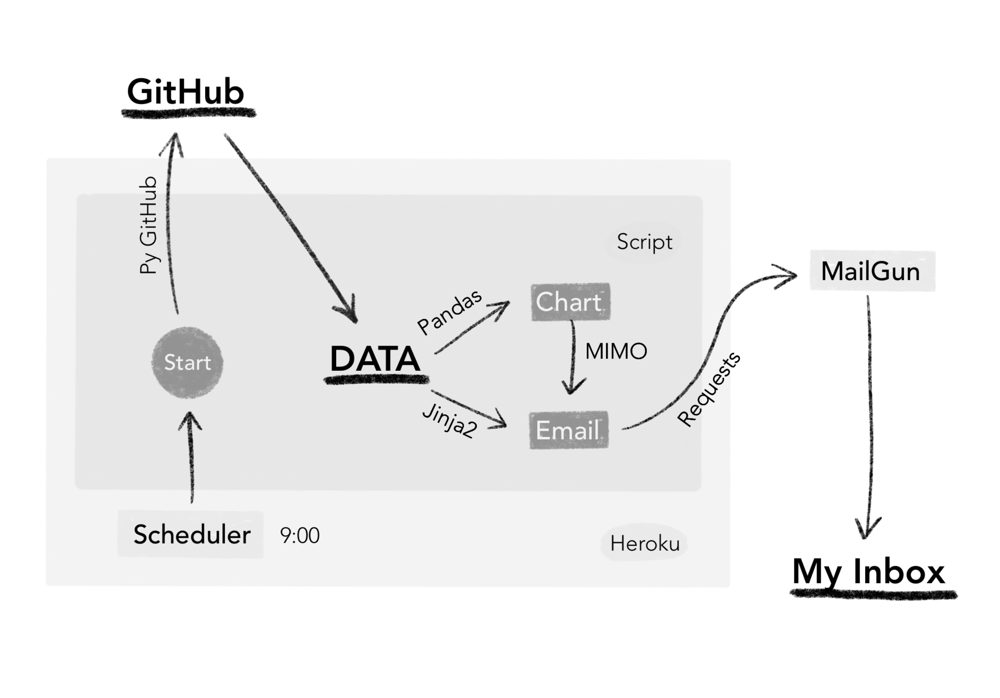
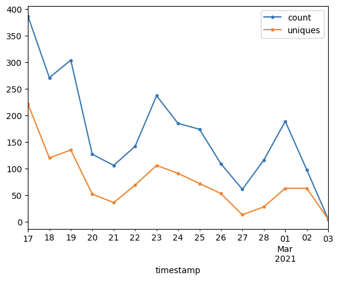

The [previous issue](../leits-makes-stuff-1) was about the idea and scoping of Proof Of Concept. And now it's time to implement it! Below I will tell you how I came from nothing to this:

One of the most important things for PoС is the speed of implementation, so I decided to use boring technologies that I’m familiar with.

> All source code you can find on GitHub [here](https://github.com/leits/OhMyCode).

### Data collection

First of all, I started with a python script that collects data from GitHub.

This source has two interfaces: REST API and GraphQL. The last one is optimized and recommended. It gives you more information with the same rate limit of 5K requests per hour. However, the REST API has a well-documented PyGithub client library, so I used it as a start point.

Data that I needed:

- Numbers of downloads, views, stars, and open issues
- Issues and Pull Requests that have been updated
- Main referrers and views over the past two weeks

Almost all data can be easily collected by several client methods. Only traffic info requires an access token which can be obtained in the account settings.

### Data visualization

Now we need to visualize the views on the repository with a line chart.

Firstly, I tried the most popular visualization library [matplotlib](https://github.com/matplotlib/matplotlib). But its configuration didn’t seem clear to me, so moved on with other options.

Stopped at [altair](https://github.com/altair-viz/altair), its result from the box was quite nice and simple. But I abandoned it as well while implementing the email sending. The reason was that altair saves the rendered image in a specified path. And I would like to avoid disk operations (writing and reading the image in the same process).

Fortunately, I found a chart generator in [pandas](https://github.com/pandas-dev/pandas) (a library for data analysis) that uses matplotlib under the hood. Working with it is very simple: create a table, add data, and plot lines.

I redirected the chart output to the buffer using built-in [bytesIO](https://docs.python.org/3/library/io.html#io.BytesIO), thus avoiding writing then reading from disk.

### Data presentation

Regarding the format of the letter, markdown was the first idea I came up with. As it turned out, it was a terrible one.

At the outset, I found out that email can be only html or plain text. Therefore, the markdown must be rendered in html to have an intended look.

For this purpose, I tried [markdown](https://github.com/Python-Markdown/markdown) library. It's good to create markdown files and very convenient in working with text and tables. However, it renders the content in html without any styles. Hence, the result was far from a pretty looking markdown in editors.

At this point, my inner desire to make things prettily overcame my need to minimize the effort on PoC.

So I found [marked.js](https://github.com/markedjs/marked) and learned that tables are an extension to the original markdown. While I was trying to run CLI of this lib in the console, I got the same result: bare html without css.

Next was [markdown-it.js](https://github.com/markdown-it/markdown-it). It was getting even harder because this lib didn’t have a CLI. But the [demo](https://markdown-it.github.io) looked tempting, so I wrote a js script that reads the file, uses markdown-it, and writes the result back to the file. And you know what? The same result. Bare html.

That was a failure.

And at the moment when I found [script](https://github.com/sindresorhus/generate-github-markdown-css) that gets styles from GitHub for markdown rendering, I stopped.

The first thing I realized was that I don't really need tables. I can display this information in plain text and it looks readable.

The second is that I don't need a markdown at all. I chose it because I liked its simple and nice look. But if I need to send html, why not to generate it directly?

So I went back to boring technology. I took [Jinja2](https://github.com/pallets/jinja) and rendered html from the template. The code has almost halved, and rationality has doubled.

### Data sending

The last step is sending it all by email.

As an email service, I took Mailgun. It’s free for three months with 5K emails/month, and then $0.8 for every 1K emails. The interface is as simple as possible: send a request for a specific URL with an authentication token. Used [requests](https://github.com/psf/requests) for HTTP calls.

To send pictures in the body of the letter (not as an attachment), you need to enclose them as a MIME object. The name of the object is specified in the image tag, and the email client displays it in the body.

The built-in [email.mime](https://docs.python.org/3/library/email.mime.html) handles this perfectly.

Well, the script works, so let’s make it run automatically. Following reliable "boring" technologies, I took [Heroku](https://www.heroku.com). For the current solution, a free instance and Heroku Scheduler are enough to run the script at a certain time.

### So,

The Proof Of Concept is completed.

Next, I plan to save the data to show the trends, make the report more informative and prettier.

And I also noticed the strange behavior of issue filtering in GitHub API, which I need to research.

---

The main motto of this post:

> Use boring technologies

This is almost always the right choice.

---

[Subscribe](https://leits.substack.com/welcome?r=h8qz8&utm_campaign=account&utm_medium=web&utm_source=leits.me) to receive the latest issue!
