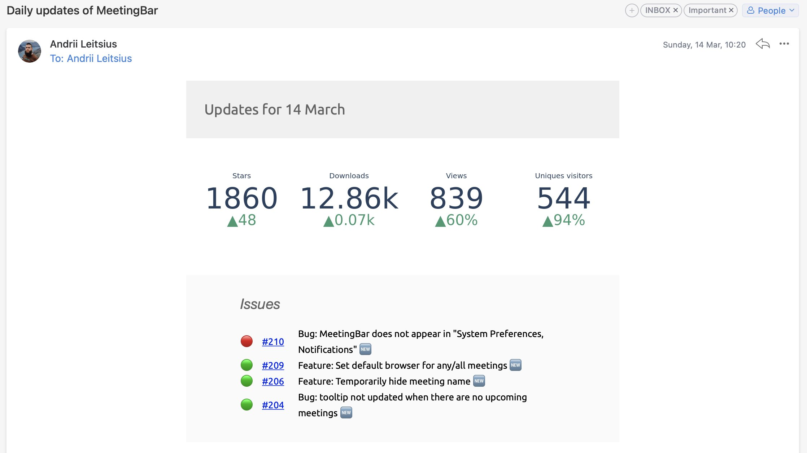

I have good news for you. When you launch something, your first user appears very quickly. And it's you.

First, you solve your pain, and then you solve this pain for others.

But there is also bad news: resolving pain for you may not wholly solve others' pain. Or maybe it's not so painful for them. Pretty harsh, right?

I have been thinking about this for a month since my previous post. When the previous issue was in the email boxes, PoC had already been working and meeting my needs. I received a report every morning.

I've made a lot of useful but not important improvements this month. This time I will skip them and the technical details of their implementation.

> Tell me, are you interested in reading low-level implementation details? Please reply to this letter with even one sentence, to let me know. Interested in your opinion.

Among handy things, the name is first.

_OhMyCode_

It seems easy and friendly to me. And not even overused by other products.

Next, I realized that my pain solvers are quite specific, and it isn't actually a pain for others. Two out of two, yeah?

Why specific? I am interested in very particular data very peculiarly grouped—for example, the total downloads of all releases' assets. And I don't need info about new commits in the repository because only I have the right to push and merge.

But why it isn't a pain for others? I can't find a similar service, so I decided to ask the audience if they would find it helpful. I prepared a post with a link to the waitlist, published it on several subreddits, IndieHackers, and HackerNews.

And didn't get any reply or upvote. It's good that I've already gathered a dozen people interested in the beta; because of such a result, the project could be curtailed.

So I decided to go with something simple so people could try it. But the current version is not suitable at all. Just because it solves only my problems.

Next, I'll try to abstract from them and make a simple MVP that will be useful for more people.

And while I'm working on it, you might find handy [SourceKarma](https://sourcekarma.vercel.app). Simple tiny service to discover how people react to your comments on GitHub. I want to do something just that "easy".

---

[Subscribe](https://leits.substack.com/welcome?r=h8qz8&utm_campaign=account&utm_medium=web&utm_source=leits.me) to receive the latest issue!
